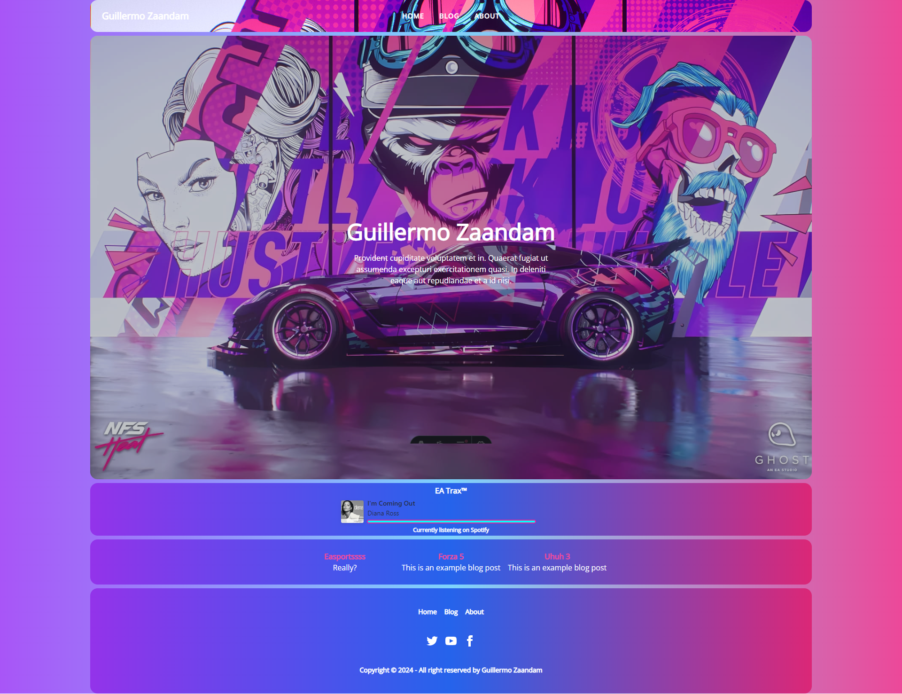

# New Portfolio website Guillermo Zaandam

# What to do

- Excellent SEO Built In
  Open Graph Tags (Twitter, Facebook, etc.)
  User Declared Canonical URLs
  RSS Feed
  XML Sitemap
  Robots.txt
  JSON LD Schema
  Markdown based blog posts with featured images
  Extremely minimal styles
  Performant Google Fonts Setup
  Remark (Table of contents)
  Astro-imagetools
  Build

- [x] General Functions
- [x] About page
- [x] Blog page
- [x] Functions showing 3 or 5 titles and small quote/description
- [x] XML Sitemap (because it isn't there? https://docs.astro.build/en/guides/integrations-guide/sitemap/)
- [x] Navigate to src/data/site.js and edit to match your site's information.
- [x] Favicon
- [x] SEO (already built-in)
- [ ] Image optimization (https://astro-imagetools-docs.vercel.app/en/usage)
- [x] Remade image for musicplayer (Vehicle audio)
- [ ] Google Analytics
- [x] Social cards (https://github.com/jonasmerlin/astro-seo) (https://docs.dummyapi.online/guides/astro-social-cards/)
- [x] RSS feed
- [ ] Fuzzy search FuseJS (https://astro.build/integrations/?search=search) (https://www.fusejs.io/) example: https://github.com/satnaing/astro-paper
- [ ] Astro embed (https://astro-embed.netlify.app/)
- [ ] i18n translator
- [ ] Styling (The verge style?)

---

